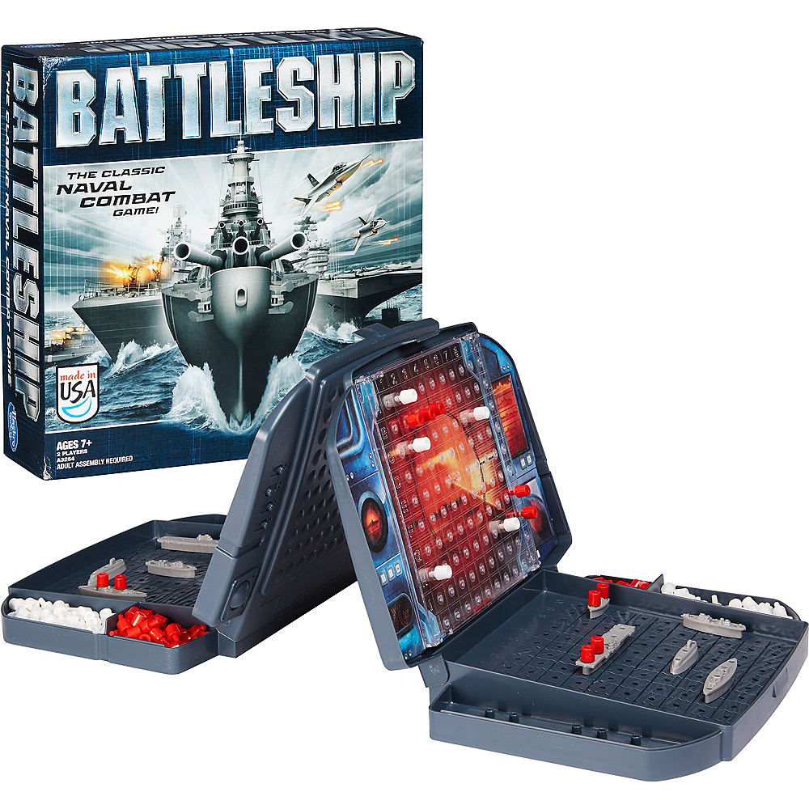
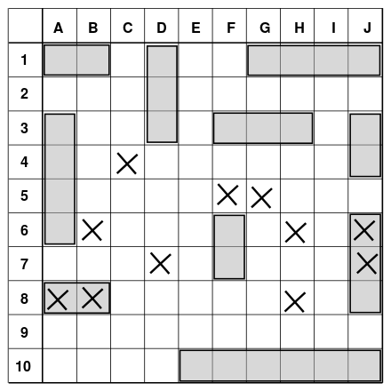

# Battleship CodeKata 🚢💥

Welcome! Your assignment is to create a simple program that emulates the classic game [Battleship](https://en.wikipedia.org/wiki/Battleship_(game)).

Just in case you've never played this game before (shame on you!) let's go through the rules quickly.

## Rules of the Game 📜
* Two players play the game, each taking turns
* Players have five ships:
    * an Aircraft Carrier
    * a Battleship
    * a Submarine
    * a Cruiser
    * a Destroyer
* Players have a grid or "ocean" where they arrange their ships
    * The grid is 10 x 10
    * The X-axis runs from A to J
    * The Y-axis goes from 1 to 10
    * Any square in the grid can be identified by combining these, for example B-3 is the square second from the left and third from the top
* After arranging the ships, they cannot be moved
* Ships occupy space on the grid, specific to the type of ship:
    * the Aircraft Carrier takes 5 squares
    * the Battleship takes 4 squares
    * the Submarine takes 3 squares
    * the Cruiser takes 3 squares
    * the Destroyer takes 2 squares
* A ship can only be positioned vertically or horizontally on the grid
* A ship cannot overlap other ships, or be placed outside of the grid
* Each round, each player takes a shot, announcing which square on the opponent's grid got hit
* The opposing player announces whether the shot _hit_ or _missed_ any of his ships
* When all squares of a ship are hit, the player announces it was sunk, including which ship it was
* The first player to sink all of his opponent's ships wins
* If both players eliminate all the opponent's ships in the same round, the game ends in a draw

Still want more info on the game? Check out this [step-by-step guide](https://www.wikihow.com/Play-Battleship).

## Hints 💡
* TBD

## Bonus Challenges 🥵
* Also tell the players which squares they already hit on the opponent's grid
* Allow players to automatically place their ships randomly on their grid
* Implement a bot to allow _single-player mode_
    * Start off simple, let the bot shoot random squares
    * Let the bot only shoot squares he has not hit yet
    * ...
* Implement _spectator mode_ where two bots duke it out

## Additional Notes 📝
You can implement the game as simple, or hard as you want to! From running the game with a test suite to text-based to a graphical interface. Go nuts!

Focus on learning, not on the results. Above all: have fun!

## Contribute 🙋
Have ideas to make this Kata better? Maybe you found a typo, or grammar issue? Or how about a new idea that can make the Kata more interesting? Let me know!
